# Todo-list

## Prérequis obligatoire :

Installer la version version 7.4 ou une version supérieure de PHP et les extensions suivantes sont :

- [intl](http://php.net/manual/en/intl.requirements.php)
- [libcurl](http://php.net/manual/en/curl.requirements.php) 
- [mbstring](http://php.net/manual/en/mbstring.installation.php)
- [mysqlnd](http://php.net/manual/en/mysqlnd.install.php)
- [mysqli](https://www.php.net/manual/fr/mysqli.setup.php)

## Contexte :

Pour m'approprier le framework Code Igniter 4, j'ai fais pour premier projet Todo-list qui permet de lister des tâches à faire.

Codeigniter4 est un framework PHP qui suit l' architecture MVC (Model View Controller) :

- Model : les classes métiers.
- View : pages html.
- Controller: méthodes du projets (évènements du projet).
- Dao : les classes d'accès à la base de données.

Schéma du MVC :

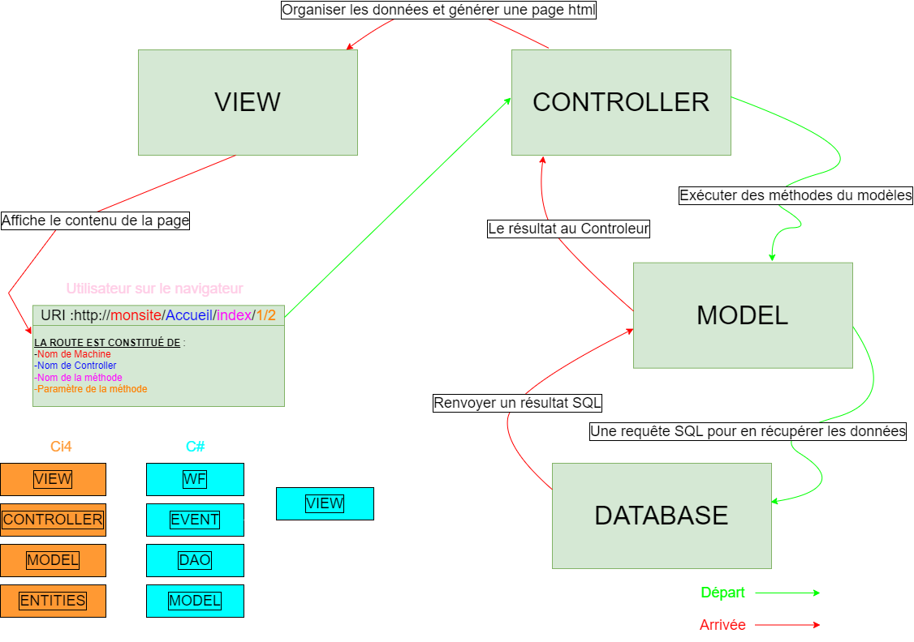

### Cas d'utilisation :

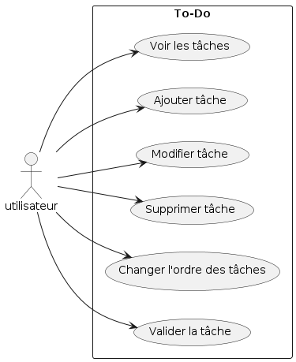

page index :

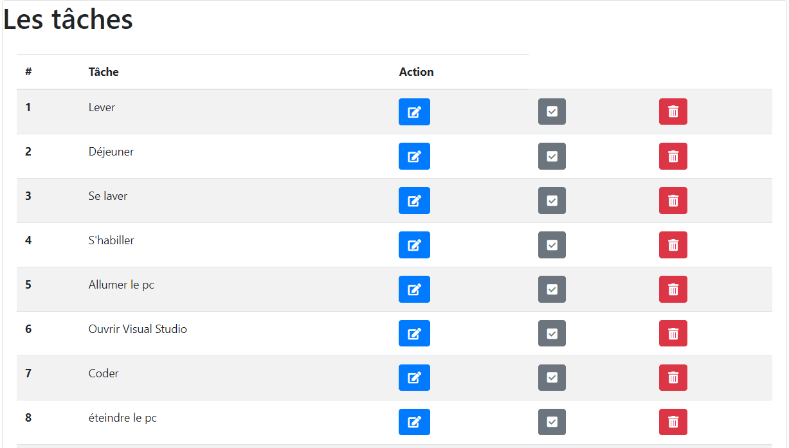

Nous avons la possibilité de réordonner les tâches en cliquant sur le bouton suivant :

Page pour modifier l'ordre des tâches (les tâches s'affichent dans l'odre croissant):

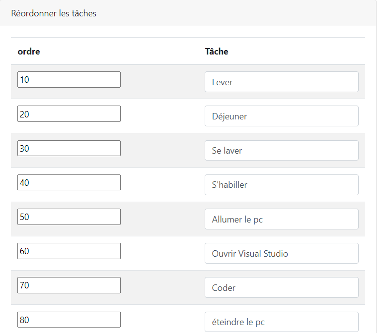

je modifie la position de la tâche éteindre le pc et l'échange avec celle dee Ranger :

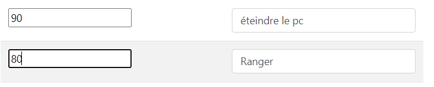

Résultat :

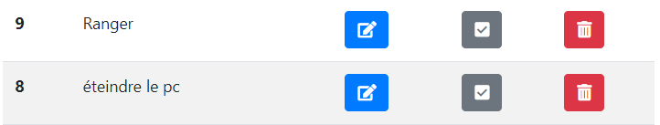

Pour ajouter une nouvelle tâche je clique sur le bouton suivant :

Formulaire  pour ajouter la tâche :

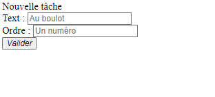

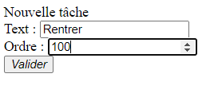

la nouvelle tâche a bien été ajouté, pour la modifier je clique sur le bouton gris :

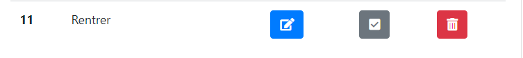

Formulaire de modification :

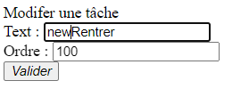

la tâche a bein été modifiée.

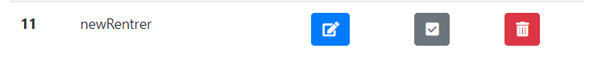

Pour indiquer que la tâche a bien été effectuée, je clique sur le bouton  bleu :

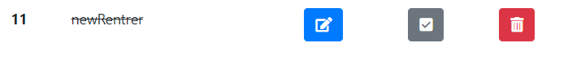

Pour supprimer la tâche qui été faîte j'ai cliqué sur le bouton rouge :

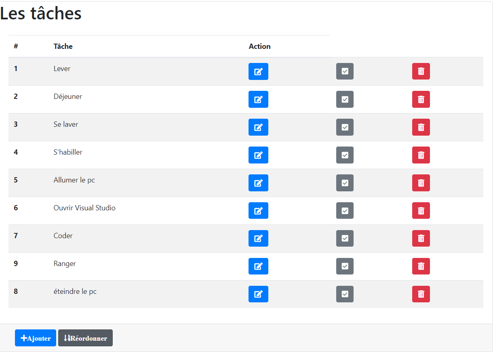

